## パソコン作業の快適さ

★★★★☆

- 椅子はワークチェアではないが、それほど悪くない
- 回線が速くて安定している
- デスクは横幅は広くないが、奥行きがある

## 部屋情報（公式サイトより）
- 面積: 32㎡
- ベッド: ツイン
- 喫煙/禁煙: 禁煙
- 特典: エグゼクティブラウンジ利用可
- 参照元: https://nagoya.hiltonjapan.co.jp/rooms/ （取得日: 2026-05-13）

## 2316号室

2026/05/13〜 2026/05/16宿泊

- ヒルトンルームクイーンからのアップグレード
- 椅子は[Vitra Softshell Chair](https://www.vitra.com/ja-jp/product/details/softshell-chair-five-star-base)
	- ヒルトン東京のジュニアスイートエグゼクティブキングと同じ
	- ワークチェアではないが、それほど悪くない
- デスクは角に丸みがある正方形で、横幅は広くないが奥行きがある
- 回線が速くて安定している
- 窓際にラウンジチェアあり
- ベッドサイドにワイヤレス充電パッド + USB充電ポート、コンセント
- セイコーのデジタル時計（温度・湿度表示付き）
- ネスプレッソマシン + 電気ケトル、ウェルカム水あり
- テレビは Bravia で、Netflix 等の動画サービスに対応
- 加湿空気清浄機がないのが残念
- 浴室
	- バスタブ + シャワーブースガラス区切り
	- シャワーは通常のとレインシャワーの2つ。通常のやつは高さを変えられないのがいまいち
	- 洗面台は大理石カウンターのアンダーシンク（Duravit）
	- アメニティは Crabtree & Evelyn
- 部屋着は浴衣とセパレートタイプの両方あり
- ウェルカムスイーツとして「八丁味噌かりんとう」（KARINTO）
- 眺望は北東向きで、目の前に大きなビル（中日ビル）

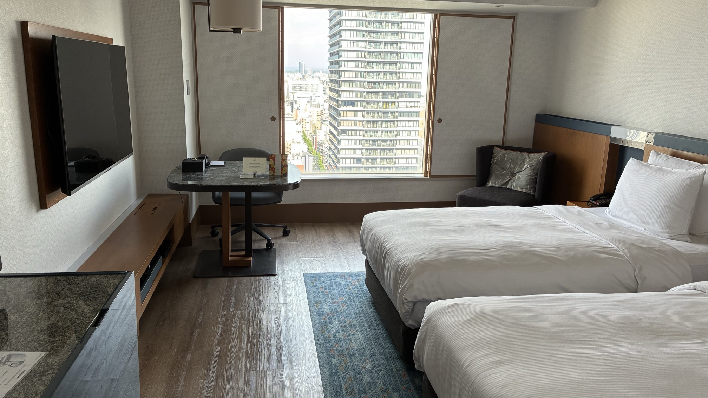

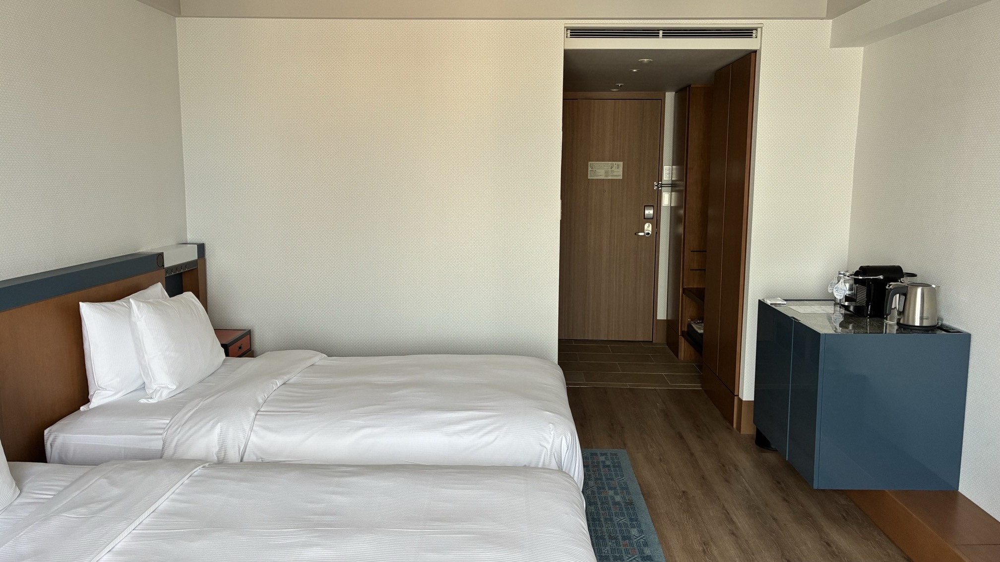

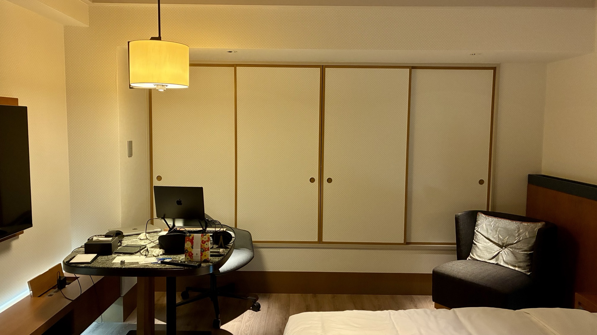

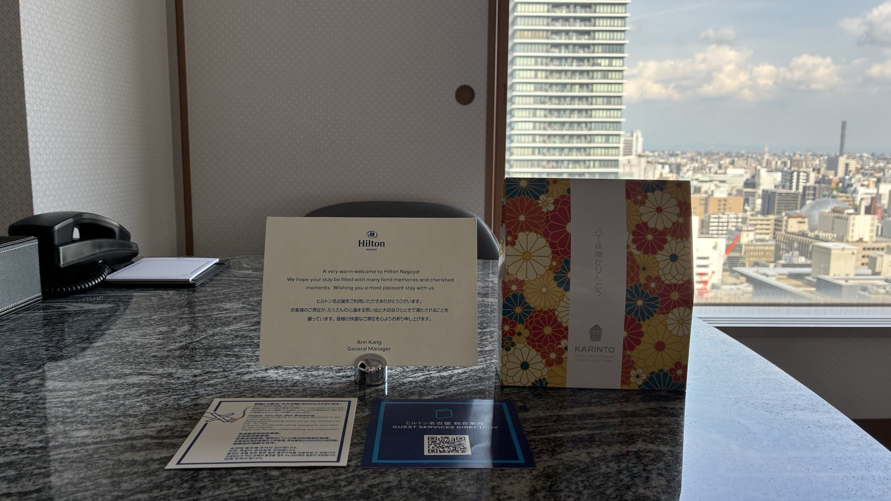

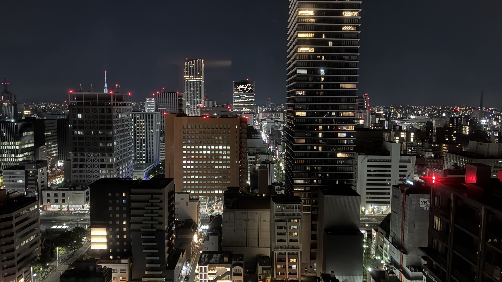

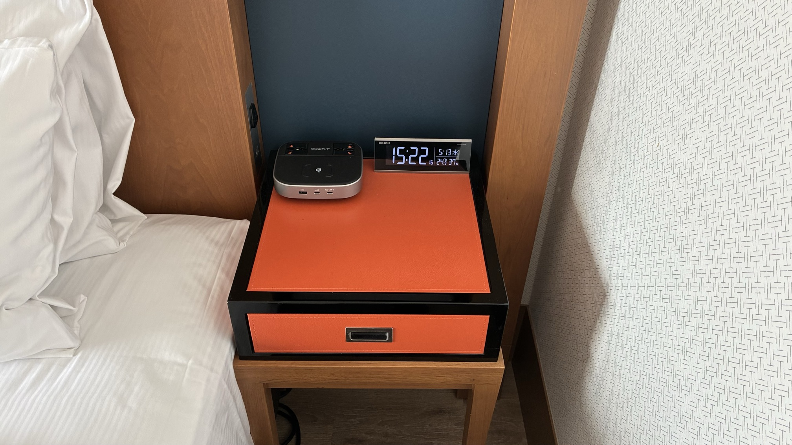

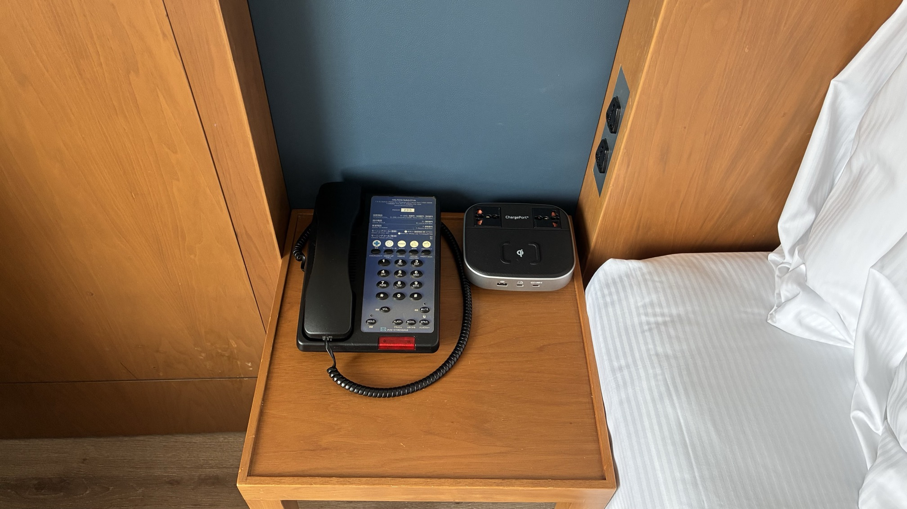

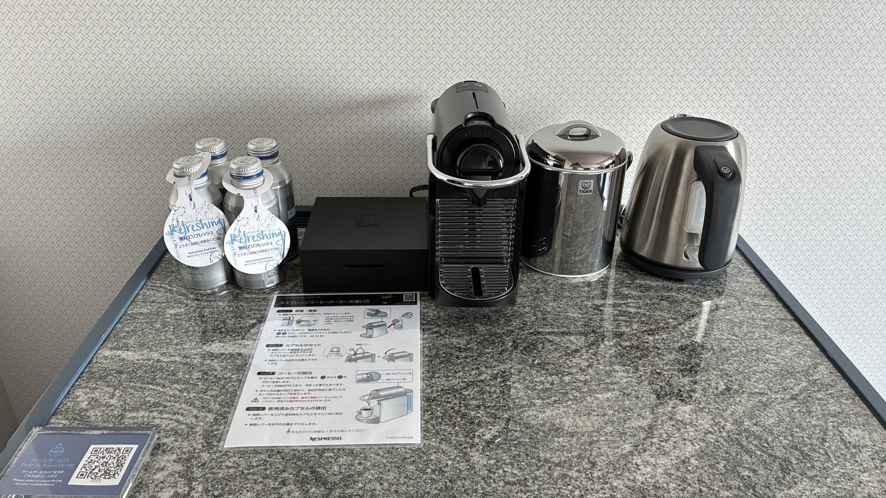

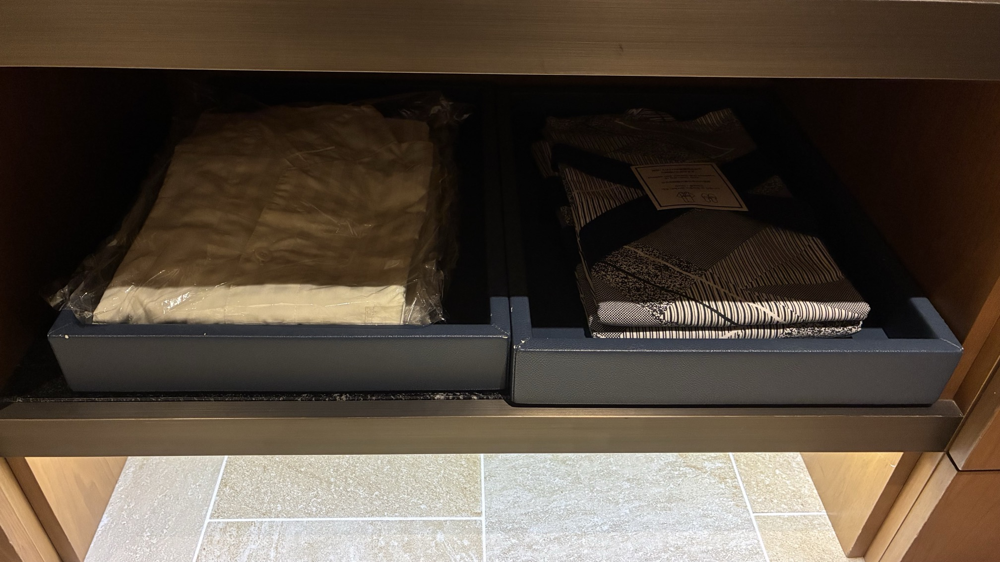

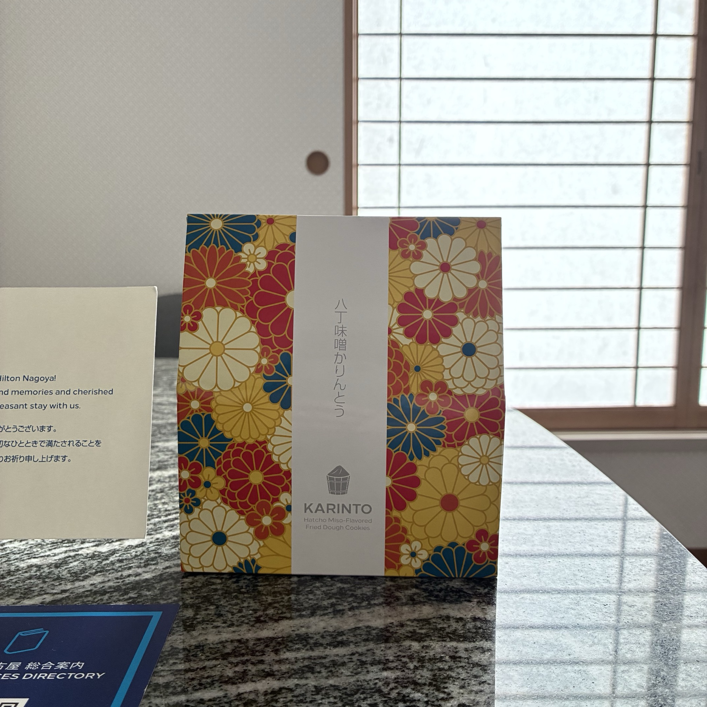

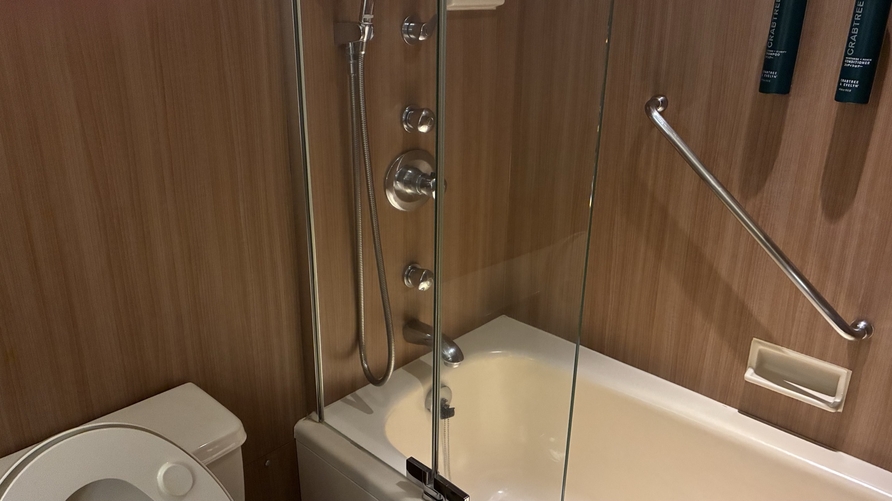

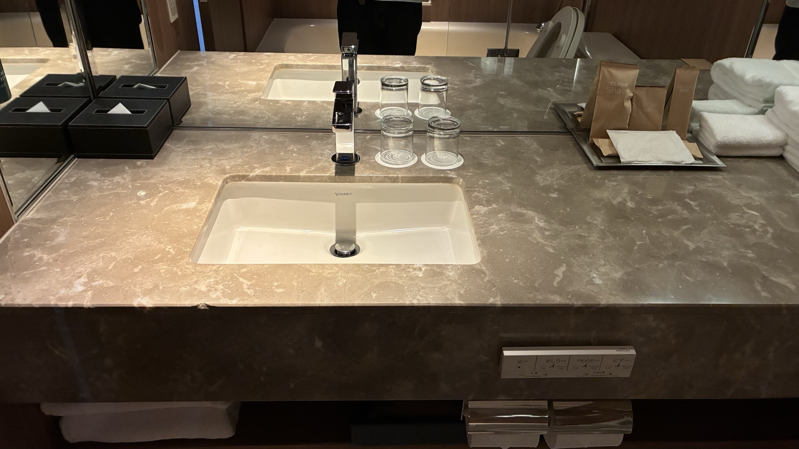

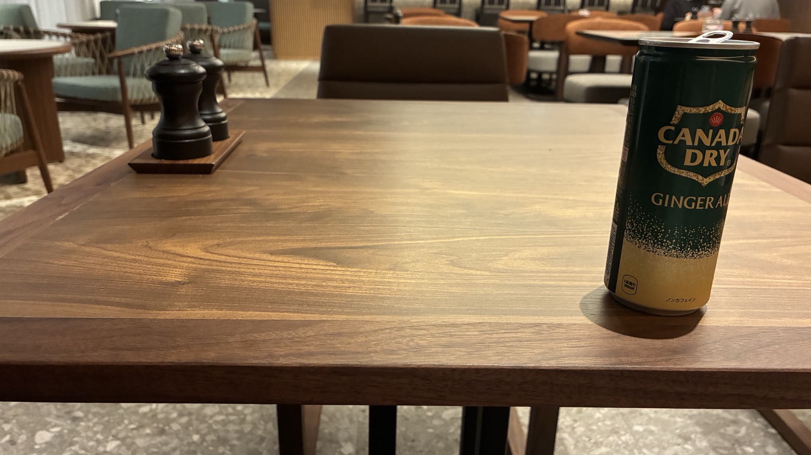

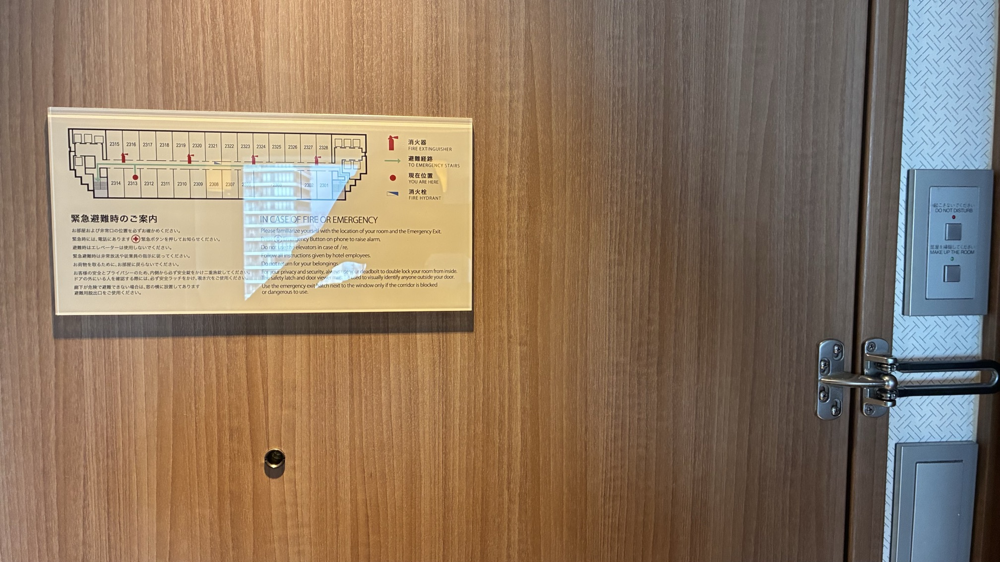
