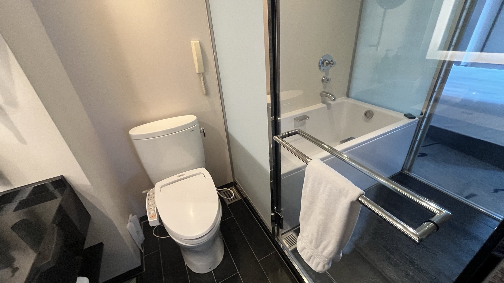
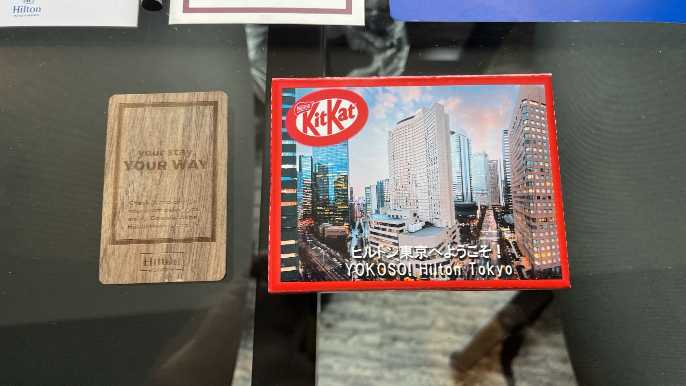

## 部屋情報（公式サイトより）
- 面積: 44㎡
- ベッド: キング 194×205cm（1台）
- 利用人数: 3名
- 喫煙/禁煙: 禁煙
- 特典: エグゼクティブラウンジ利用可
- 参照元: https://tokyo.hiltonjapan.co.jp/rooms/executive_junior_suite_king （取得日: 2025-09-07）

## 2125号室

2025/09/4〜 2025/09/05宿泊

- デラックスキングからのアップグレード
	- 3日前にアップグレード連絡が来た
- 西新宿駅から直結でC8出口
- エレベーターがすぐ近く
- 椅子は[Vitra Softshell Chair](https://www.vitra.com/ja-jp/product/details/softshell-chair-five-star-base)
	- キャスターがないタイプなので、位置の微調整がしにくい
	- ワークチェアではないのでパソコン作業には不向き
	- ボトムのヒルトンルームは客室写真を見る限り、Steelcase Think Chairっぽいので、そちらの方が快適に仕事できそ
- デスクは楕円型で、広さはパソコン作業するには十分
- 浴室
	- トイレと扉で区切られているのは良い。
	- 入った瞬間なんかにおうけど、何の匂いかわからない。いい匂いではないが不快でもないし、すぐ気にならなくなった。
	- ボディソープが液体ではなく固形
	- シャワー水圧はちょっと弱い気が
- ミニバー無料。といっても食べ物はない。ビール、コーラ、炭酸水、水、といったあたり。
- ドライヤーがダイソン
- デジタルキー、対応していてアプリからリクエストはしたが、「Your Digital Key is on its way」という表示のままで、使えるようにならなかった。
- エグゼクティブラウンジ
	- あまり広くない、と思ったら奥の方にも席があった
	- カクテルタイム、人は多かったけど混雑してる、というほどでもなかった
	- 朝食、7:30行ったが、それほど混んではいなかった
	- 卵料理が選べて、席まで持ってきてくれる。本日のスペシャルはエッグベネディクトっぽいやつだった。（なんか違う名前をスタッフの人は言ってた気がする）

